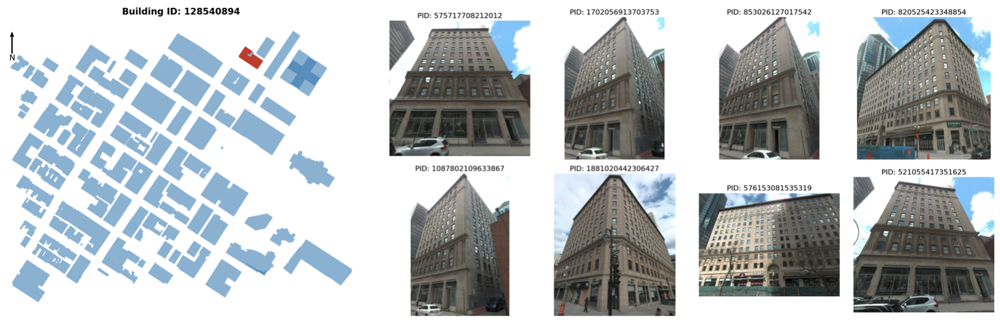
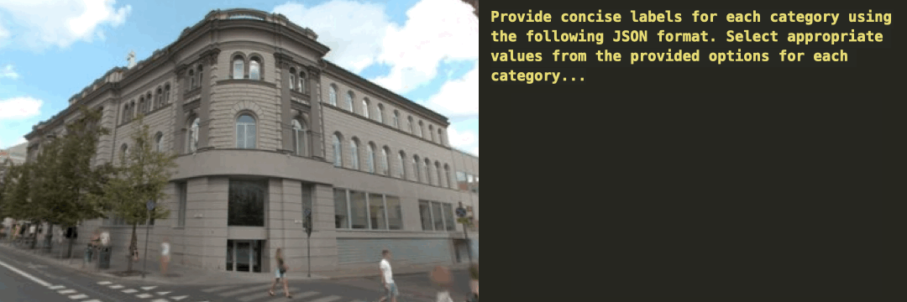
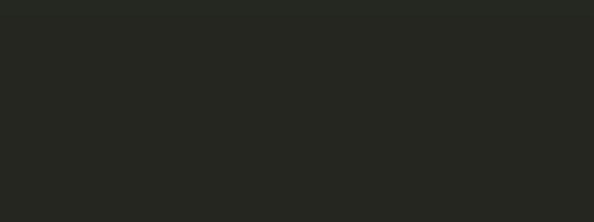

<p align="center">
  
  </p>

<p align="center">
  Tutorial preview: <a href="https://colab.research.google.com/drive/1hFKdHCBz9KJTDwCwWsMXOHH5wwOHmnyv?usp=sharing">[Google Colab]</a>
  </p>

# OpenFACADES
An Open Framework for Architectural Caption and Attribute Data Enrichment via Street View Imagery

## Overview
<p align="center">

 </p>
 
## To Do List
- [x] Release code for building data harmonization.
- [x] Release code for integrating building and street view imagery data.
- [x] Develop Google Colab tutorial for retriving building image data.
- [ ] Develop Google Colab tutorial for building labeling and captioning.
- [ ] Release fine-tuned model (1B, 2B).
- [ ] Release global building dataset.
- [ ] Release training data.
- [ ] Integrate more SVI platforms into the framework.


## Installation

To install OpenFACADES, follow these steps:

1. Clone the repository:
  ```bash
  git clone https://github.com/seshing/OpenFACADES.git
  ```

2. Install the package and required dependencies:
  ```bash
  pip install -e OpenFACADES/.
  pip install -r OpenFACADES/requirements.txt
  ```

## What can our method do?

1. **Integrating multimodal crowdsourced data**: acquire building data and street view imagery from crowdsourced platforms for selected areas, and conduct isovist analysis to integrate them.

2. **Retrieving building image data**: perform object detection to identify target buildings in panoramic images and reproject them back to a holistic perspective view, with image filtering functions to select high-quality building images.


3. **Developing datasets and multimodal models**: apply state-of-the-art multimodal large language models to annotate building images with multiple attributes, including building type, surface material, number of floors, and building age, and provide detailed descriptive captions.
<p align="center"> 
  
  <br>
  <em>(a) building attributes</em>
</p>

<p align="center"> 
  
  <br>
  <em>(b) image captioning</em>
</p>

## Quick start

To acquire individual building images (Steps 1 & 2 above) for an area, you can simply run:
  ```bash
  python OpenFACADES/run.py \
    --bbox=[left,bottom,right,top] \
    --api_key='YOUR_MAPILLARY_API_KEY'
  ```
*Note: please check Mapillary has panoramic images available for the selected area.* 

**Example bbox:**  <br />
```[8.552,47.372,8.554,47.376]```: an area in Zurich, Switzerland;<br />
```[-81.382,28.540,-81.376,28.543]```: an area in Orlando, the US;<br />
```[-70.660,-33.442,-70.655,-33.437]```: an area in Santiago, Chile;<br />
```[-73.578,45.497,-73.569,45.502]```: an area in Montreal, Canada;<br />
```[37.618,55.758, 37.628, 55.763]```: an area in Moscow, Russia;<br />
```[25.273,54.684,25.283,54.687]```: an area in Vilnius, Lithuania.

**Output paths:**  <br />
detected building images: ```output/02_img/individual_building```;  <br />
building image ids after filtering: ```output/02_img/individual_building_select.csv```.

## Acknowledgement
We acknowledge the contributors of OpenStreetMap, Mapillary and other platforms for providing valuable open data resources and code that support street-level imagery research and applications.
